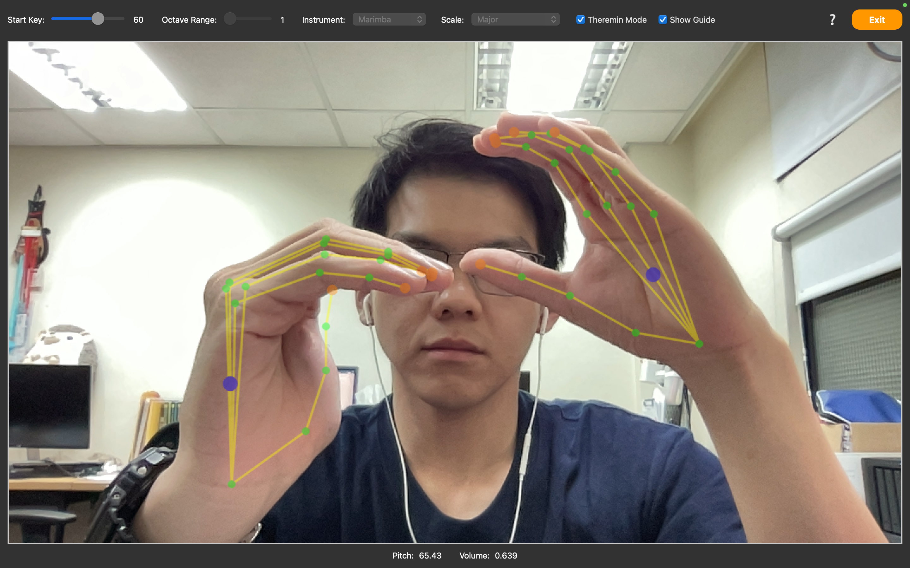

# Veloma - Virtual Theremin

A gesture-controlled musical instrument inspired by the Theremin, built with PyQT (UI), Mediapipe & OpenCV (Computer Vision), and SCAMP (Audio).

## Overview

Veloma uses webcam to track hand movements and translates them into musical expression:

### Modes:

- Default mode: Discrete notes playing based on hand position.
- Theremin mode: Continuous pitch and volume control using hand movements.

### Controls:

- **Single Hand Mode**: Use one hand to control pitch and volume.
  - Vectical movement of the hand controls volume.
  - Horizontal movement of the hand controls pitch.
- **Two Hand Mode**: Use both hands for advanced control over pitch and volume.
  - **Right Hand**: Controls pitch - move right hand left/right to change pitch.
  - **Left Hand**: Controls volume - move left hand up/down to adjust volume.
- **Extra**:
  - Make a fist or hold a finger close to palm center to replay last note.

### Features:

- **Gesture Recognition**: Uses Mediapipe for real-time hand tracking.
- **Audio Synthesis**: Utilizes SCAMP for generating sound based on hand movements.
- **Customizable**: Modify parameters like starting note, octave range, scale, instrument

## Development

1. Install dependencies in `pyproject.toml`.
2. Run `main.py`

If using `uv`:

1. Install dependencies by running `uv sync`.
2. Run app by executing `uv run main.py`.

## Demo

